## ポイント

モバイルアプリを作るときに、ビルドからテスト、配布まで全部一貫して速く良い感じにやりたい

## 01: 今回のデモアプリ Smart Hotel 360 の説明

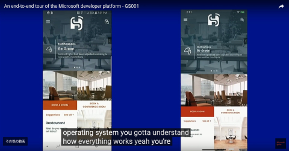

トップページ (iOS/Android )   
→ ホテル予約ページ (アプリが位置情報を取得していることを言及)    
→ 実際に日付を指定して予約をする     

A「両方とも、まるで iOS や Android アプリっぽく動くね」     

B「っぽい、じゃないよ。本当に iOS /Android のネイティブアプリなんだよ。Xamarin はネイティブUI /API を 100% カバーしているんだよ」

ホテルの部屋のアメニティ確認。IoT のセンサーからのデータを表示している

↓ Xamarin の NFC 対応のデモ。スマートキーとして動いている

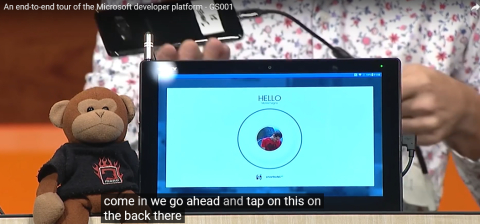

### 「デジタル・コンシェルジュ」bot

Azure Bot Service を使った Azure Skype bot を使って、     
コーヒーを注文

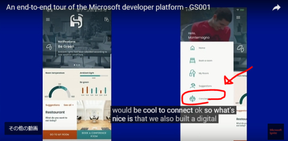

"Coffe" と打つとクーポン券を発行してくれる

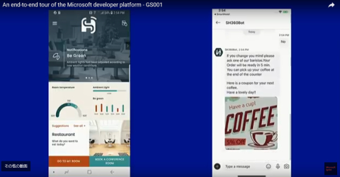

最初から最後まで .NET ということです、という流れで「ではコードに入りましょう」

## 02: Xamarin のコード説明 (Client 編)

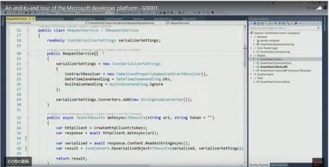

"Now I'm inside the Visual Studio."

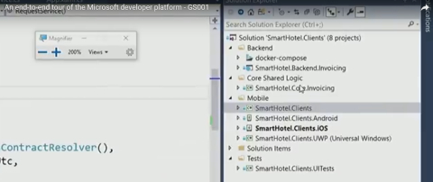

「モバイルの中には、ひとつの、.NET Standard で書かれた、ひとつの共有ファイルがあります。ローカルDBへのアクセスや Azure への接続など、あらゆる共通ビジネスロジックの記述がこの中に入っています。この共有空間には、すべてのビジネスロジックやネイティブUIの記述が入っており、このプロジェクト全体のコード共有率90%を実現しています。

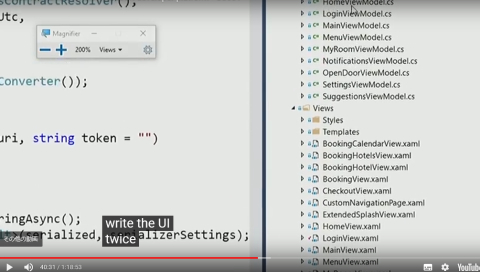

Model や View フォルダを開いて中を見せる。

「つまり、iOS用、Android用って、UI を２回書くことはしないってことですね？」

「もちろんです。そんなことしたくない。Xaml で書けば、勝手にネイティブコントロールを呼び出してくれます」

## 03: エミュレータ編

### Docker と Android エミュレータの共存編

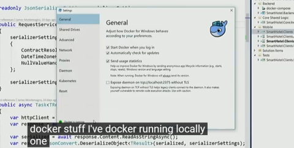

ローカルで Docker が動いていますね。

でも今までは、これは Android アプリ開発者はちょっと困ってたんだよね。

Docker が動くには Hyper-V が必要です。    
でも昔の、Windows 上の Android エミュレータは、Hyper-V と共存はできませんでした。厳密に言うと、動くことは動くけど、めっちゃ遅くなった。立ち上がるまでに１０分とか。

ということで、Xamarin チームは Hyper-V チームと協力して、Androidエミュレータが Hyper-V で動くようにしました。結果、Docker を動かしながら Android エミュレータを一緒に動かす、ということができるようになりました。

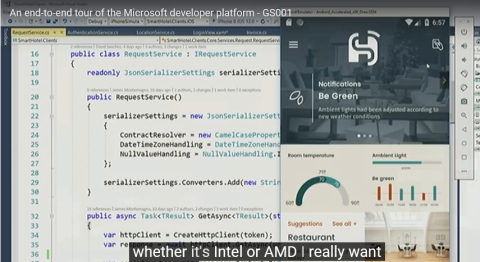

Android アプリ開発者で、またコンテナも好きって人は、今までは、どっちかをやるときは、Hyper-V 切って再起動して、みたいにやらないといけなかったけど、     
これからは、Android エミュレータも Docker も Hyper-V で動くので、そういう再起動祭りをしなくて良くなるんですね。    

### iOS シミュレーター編

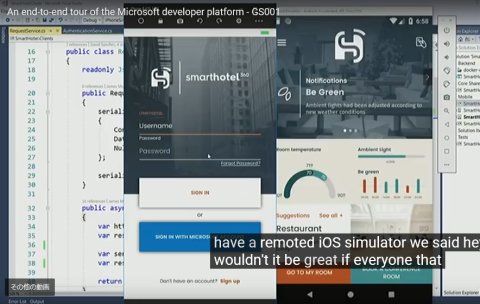

画面にタッチなどできますね。

Mac にリモートで繋がれており、Mac が出している iOS シミュレーターをここにそのまま映しているというわけです。   
だから、位置情報だろうが何だろうが、本家の iOS シミュレーターができることは全てここでもできるということです。

Microsoft アカウントでログインする、っていうところを押す

## 04: バックエンド編

### .NET Standard 編

Docker で動いている、Web API と ASP.NET Core 製のバックエンド。

作った REST Web API を叩きたいので、このように書きます。

HttpClient を作って、GetAsync して、ReadAsString して、      
最終的に JSON をデシリアライズする

ポイントとしては、Xamarin.なんたらとか James.なんたらとか、独自の名前空間ではなく、ふつうに .NET の標準のものを使えているということ。    
WinForm とか WPF とかの経験がある人は、そのナレッジをそのまま使える

.NET Standard で定義されている API であれば、WinForm とか WPF とかのコードとかをそのまま持ってこられる

### 認証編

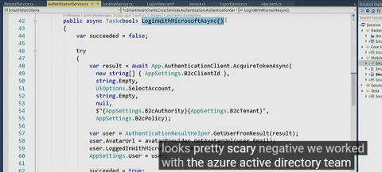

Azure Active Directory チームと協力して、この一行だけで認証をよしなにやってくれる API を作りました。

これを呼ぶだけで、OAuth のめんどくさいやりとり、例えば、アクセストークンの取得や、リフレッシュトークンの管理や、リフレッシュトークンを使って新しいアクセストークンを取得したりとか、を全部裏でやってくれます、

### 位置情報編

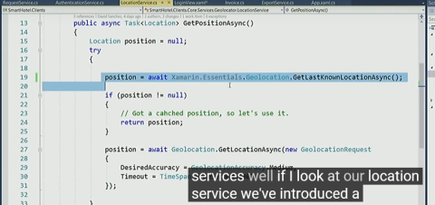

Xamarin.Essentials と呼ばれる、クロスプラットフォームの API 群では、     
位置情報、加速度、キーチェーンなど、30を超えるネイティブ API を提供します。

## 05: UI 編

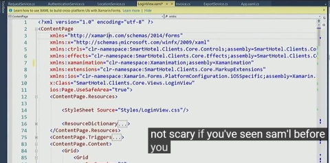

Xaml ですね。最近は CSS もサポートしてるよ

また、OnPlatform で、Android の時はこれ、iOS の時はこれ、と、簡単に出し分けができます

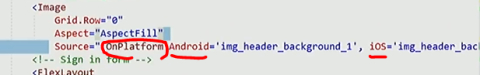

また、フォームの入力値のバリデーションでの色の出し分けも Xaml 内でできます。

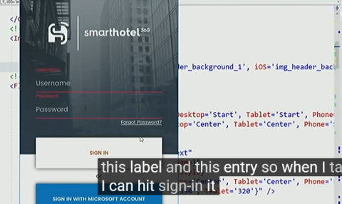

## 06: バックエンドとクライアント間でのコード共有

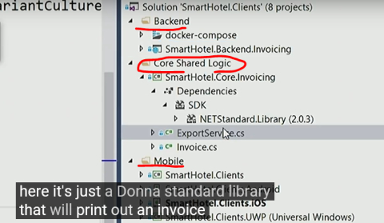

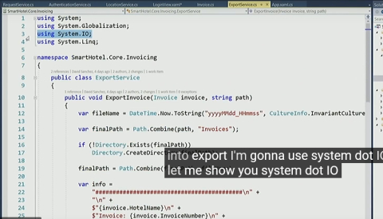

名前空間が System. 系しか無い。

このクラスで iOS や Android などに出力できます。    
要するに、たとえば、Windows だったら "C:\" など、プラットフォームごとのファイルパスなどを気にしなくて良いということです

