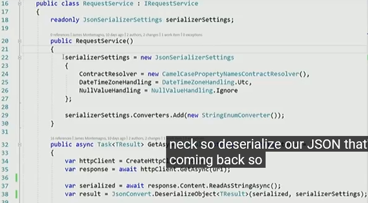

Tech Summit Japan 2018 で Drew さんとやる General Session の demo スクリプトをここに書いておきます。    

これは Microsoft Ignite 2018 の General Session でやったものに沿って進めるセッションです。（私個人でやるブレイクアウトセッション #AC02 とは別物）

## ポイント

モバイルアプリを作るときに、ビルドからテスト、配布まで全部一貫して速く良い感じにやりたい

## 事前準備

* Android / iOS 実機にアプリをインストール済み・起動しておく
* 開発マシンで Docker for Windows を立ち上げておく
* VS では説明順にコードのタブを開けておく
    1. [SmartHotel.Clients/Services/Request/**RequestService.cs**](https://github.com/chomado/SmartHotel360-Mobile-master/blob/master/Source/SmartHotel.Clients/SmartHotel.Clients/Services/Request/RequestService.cs)
    1. [SmartHotel.Clients/Services/Authentication/**AuthenticationService.cs**](https://github.com/chomado/SmartHotel360-Mobile-master/blob/master/Source/SmartHotel.Clients/SmartHotel.Clients/Services/Authentication/AuthenticationService.cs)
    1. [SmartHotel.Clients/Services/Geolocator/**LocationService.cs**](https://github.com/chomado/SmartHotel360-Mobile-master/blob/master/Source/SmartHotel.Clients/SmartHotel.Clients/Services/Geolocator/LocationService.cs)
    1. [SmartHotel.Clients/Views/**LoginView.xaml**](https://github.com/chomado/SmartHotel360-Mobile-master/blob/master/Source/SmartHotel.Clients/SmartHotel.Clients/Views/LoginView.xaml)
    1. [SmartHotel.Core.Invoicing/**Invoice.cs**](https://github.com/chomado/SmartHotel360-Mobile-master/blob/master/Source/SmartHotel.Core.Invoicing/Invoice.cs)
    1. [SmartHotel.Core.Invoicing/**ExportService.cs**](https://github.com/chomado/SmartHotel360-Mobile-master/blob/master/Source/SmartHotel.Core.Invoicing/ExportService.cs)
    1. [SmartHotel.Clients/**App.xaml.cs**](https://github.com/chomado/SmartHotel360-Mobile-master/blob/master/Source/SmartHotel.Clients/SmartHotel.Clients/App.xaml.cs)
* App Center 開いておく

## 01: 今回のデモアプリ Smart Hotel 360 の説明 (How the demo app works)

トップページ (iOS/Android )   
→ ホテル予約ページ (アプリが位置情報を取得していることを言及)    
→ 実際に日付を指定して予約をする     

ホテルの部屋のアメニティ確認。IoT のセンサーからのデータを表示している

(We skip the NFC demo)

A「両方とも、まるで iOS や Android アプリっぽく動くね」     
Drew "I'm noticing that it's got the beautiful look and feel but also the controls poping up and the dialogues poping up, they look like Android, they look like iOS."

B「っぽい、じゃないよ。本当に iOS /Android のネイティブアプリなんだよ。Xamarin はネイティブUI /API を 100% カバーしているんだよ」    
Me "They don't just look like it; they ARE the native controls because with Xamarin you have access to a hundred percent of the native UI and native API access."

Drew "It's not just painted to look good like that"

Me "No, no, no, Everything is a hundred percent

### 「デジタル・コンシェルジュ」bot (digital concierge - Azure bot Service)

Azure Bot Service を使った Azure Skype bot を使って、     
コーヒーを注文

「今回は Skype を使いましたが、他にも Facebook や Whatsapp などとも繋げられます」

"Coffe" と打つとクーポン券を発行してくれる

Me "Now I'm happy that I have beautiful native applications, connected Skype bot and all that great stuff."

Drew ".NET top to buttom."

最初から最後まで .NET ということです、という流れで「ではコードに入りましょう」

Me "OK now I'll show you the code."

## 02: Xamarin のコード説明 (Code reading - Client side)

Me "hop over the PC now and I'm inside the Visual Studio."

Me "The first thing I want shou you Drew is that this is gonna look and feel like a .NET project"

(Drew "Right")

( Opened file: [SmartHotel.Clients/Services/Request/RequestService.cs](https://github.com/chomado/SmartHotel360-Mobile-master/blob/master/Source/SmartHotel.Clients/SmartHotel.Clients/Services/Request/RequestService.cs) )

Me "so let's go ahead and zoom in over here (to the solution explorer) and show you what a Xamarin project looks like."

「モバイルの中には、ひとつの、.NET Standard で書かれた、ひとつの共有ファイルがあります。ローカルDBへのアクセスや Azure への接続など、あらゆる共通ビジネスロジックの記述がこの中に入っています。この共有空間には、すべてのビジネスロジックやネイティブUIの記述が入っており、このプロジェクト全体のコード共有率90%を実現しています。

Model や View フォルダを開いて中を見せる。

「つまり、iOS用、Android用って、UI を２回書くことはしないってことですね？」     
Drew "OK, so, you didn't write UI twice."
     
Me "No, I did not. I don't want to do that. I wrote it once."    
「もちろんです。そんなことしたくない。Xaml で書けば、勝手にネイティブコントロールを呼び出してくれます」

## 03: エミュレータ編 (Emulator talk)

Me "And we also want to make sure our developers are productive on their machines."    

### Docker と Android エミュレータの共存編 (Docker & Android emulator runs at the same time)

ローカルで Docker が動いていますね。 I've docker running locally.

One thing that's always been an issue for Android developers is that they can't really run the Android emulators.

でも今までは、これは Android アプリ開発者はちょっと困ってたんだよね。

(Explains why Android developers had trouble when they want to run docker and Android emulators at the same time)     
Docker が動くには Hyper-V が必要です。    
でも昔の、Windows 上の Android エミュレータは、Hyper-V と共存はできませんでした。厳密に言うと、動くことは動くけど、めっちゃ遅くなった。立ち上がるまでに１０分とか。

So Xamarin team worked with the Hyper-V team and extended Hyper-V to run the native Android Google emulators,    
so you can run docker side-by-side the Android emulators right super fast on your hardware whether it's Intel or AMD.

ということで、Xamarin チームは Hyper-V チームと協力して、Androidエミュレータが Hyper-V で動くようにしました。結果、Docker を動かしながら Android エミュレータを一緒に動かす、ということができるようになりました。

Android アプリ開発者で、またコンテナも好きって人は、今までは、どっちかをやるときは、Hyper-V 切って再起動して、みたいにやらないといけなかったけど、     
これからは、Android エミュレータも Docker も Hyper-V で動くので、そういう再起動祭りをしなくて良くなるんですね。    

### iOS シミュレーター編 (iOS simulator talk)

画面にタッチなどできますね。

Mac にリモートで繋がれており、Mac が出している iOS シミュレーターをここにそのまま映しているというわけです。   
だから、位置情報だろうが何だろうが、本家の iOS シミュレーターができることは全てここでもできるということです。

Microsoft アカウントでログインする、っていうところを押す

## 04: バックエンド編 (Code reading - server side)

### .NET Standard 編

Docker で動いている、Web API と ASP.NET Core 製のバックエンド。

( Opened file: [SmartHotel.Clients/Services/Request/RequestService.cs](https://github.com/chomado/SmartHotel360-Mobile-master/blob/master/Source/SmartHotel.Clients/SmartHotel.Clients/Services/Request/RequestService.cs) ) : 22,38

作った REST Web API を叩きたいので、このように書きます。

HttpClient を作って、GetAsync して、ReadAsString して、      
最終的に、JSON.NET を使って JSON をデシリアライズする

Drew "So what's interesting to me about this is that I don't see any 'Xamarin.HttpClient' or you know just 'ChomadoClass.HttpClient". This is the HttpClient which calls these Json serialization, the string management and that is the stuff I'm doing already on my WinForms app, on my WPF app and on my ASP.NET apps. I know this already"

Me "If you already have that code, bring it over."

Drew "Oh just bring it over. It's .NET Standard Library"

Me "Yes, .NET Standard で定義されている API であれば、WinForm とか WPF とかのコードとかをそのまま持ってこられる"

ポイントとしては、Xamarin.なんたらとか James.なんたらとか、独自の名前空間ではなく、ふつうに .NET の標準のものを使えているということ。    
WinForm とか WPF とかの経験がある人は、そのナレッジをそのまま使える

### 認証編 (talk about Authentication (OAuth with Xamarin))

( Open file: [SmartHotel.Clients/Services/Authentication/**AuthenticationService.cs**](https://github.com/chomado/SmartHotel360-Mobile-master/blob/master/Source/SmartHotel.Clients/SmartHotel.Clients/Services/Authentication/AuthenticationService.cs) )

Azure Active Directory チームと協力して、この一行だけで認証をよしなにやってくれる API を作りました。

これを呼ぶだけで、OAuth のめんどくさいやりとり、例えば、アクセストークンの取得や、リフレッシュトークンの管理や、リフレッシュトークンを使って新しいアクセストークンを取得したりとか、を全部裏でやってくれます。

このライブラリは現在 .NET Standard ライブラリの中に入っています

Drew (Explains what this one line do about OAuth) "OK so hang on, so it's that one line, (~), when you clicked the login button on iOS simulator, the one line opens the web browser to have me log in, collects the token and brings it back, is all encapsulated (~)"

### 位置情報編 Location Service

Me "What about geolocation and those other services."

(Open file: [SmartHotel.Clients/Services/Geolocator/**LocationService.cs**](https://github.com/chomado/SmartHotel360-Mobile-master/blob/master/Source/SmartHotel.Clients/SmartHotel.Clients/Services/Geolocator/LocationService.cs) )

Me "Xamarin team has introduced a new cross-platform API for developers using Xamarin called 'Xamarin Essentials'. It offers access to over 30 native APIs like location, compass, accelerometer and keychain access."

Xamarin.Essentials と呼ばれる、クロスプラットフォームの API 群では、     
位置情報、加速度、キーチェーンなど、30を超えるネイティブ API を提供します。

19 行目の `GetLastKnownLocationAsync()` から取得した最新の位置情報を取得します

## 05: UI 編　(talk about Xaml)

(Open file: [SmartHotel.Clients/Views/**LoginView.xaml**](https://github.com/chomado/SmartHotel360-Mobile-master/blob/master/Source/SmartHotel.Clients/SmartHotel.Clients/Views/LoginView.xaml))

Xaml ですね。最近は CSS もサポートしてるよ

また、OnPlatform で、Android の時はこれ、iOS の時はこれ、と、簡単に出し分けができます

また、フォームの入力値のバリデーションでの色の出し分けも Xaml 内でできます。

## 06: バックエンドとクライアント間でのコード共有

Open files:
1. [SmartHotel.Core.Invoicing/**Invoice.cs**](https://github.com/chomado/SmartHotel360-Mobile-master/blob/master/Source/SmartHotel.Core.Invoicing/Invoice.cs)
1. [SmartHotel.Core.Invoicing/**ExportService.cs**](https://github.com/chomado/SmartHotel360-Mobile-master/blob/master/Source/SmartHotel.Core.Invoicing/ExportService.cs)

名前空間が System. 系しか無い。All namespaces are "System.~"

このクラスで iOS や Android などに出力できます。    
要するに、たとえば、Windows だったら "C:\" など、プラットフォームごとのファイルパスなどを気にしなくて良いということです

Me "I can share that directly with my backend and my front."

また、これらのコードは全て GitHub に上がっています

Me "So that's the app end to end. This is all on GitHub so you can get it today, all the source code is available."

## 07: App Center - Getting Started

### the 1st tab

でもアプリはコード書いて終わりじゃないよね

Me "And of course just building app is half the battle. I need essential services that not only build and integrate but also learn from my customers, what went crashing and also test app with multiple devices. That's where VIsual Studio App Center comes in."

Xamarin じゃなくても、     
Swift や Obj-C 製の iOS アプリだろうが Java や Kotlin 製の Android アプリだろうが      
ここに書いてあるものは対応しています！

### the 2nd tab

実際のアプリです。iOS, Android の。

で、右上の新規アプリ作成をクリックする

ここで新規アプリを登録できます

でも今回は既存の iOS アプリをクリックします

画面の説明。

analytics や crash report、distribution、push 通知などに対応する SDK が配布されており、どのように使うかがここに書いてあります。

## 08: App Center - Build

(2つめのタブのまま)

Build 画面。master ブランチの歯車マークから設定を見せる。

Azure DevOps の Build Pipeline から、モバイルに特化した形にして持ってきてる。

環境変数(environment variables)にも触れる

## 09: App Center - Test

3rd tab

UI Test を書いてるんですわ

### 4th tab on the web browser

defferent devices, defferent OS version

(Drew mentions that these UI tests are executed on REAL ACTUAL PHYSICAL devices). 

## 10: App Center - Distribute

You can destribute to Android/ iOS app store and even to an Intune Company portal

## 11: App Center - Analytics

(open the 5th tab)

I can export these data to Application Insight!
